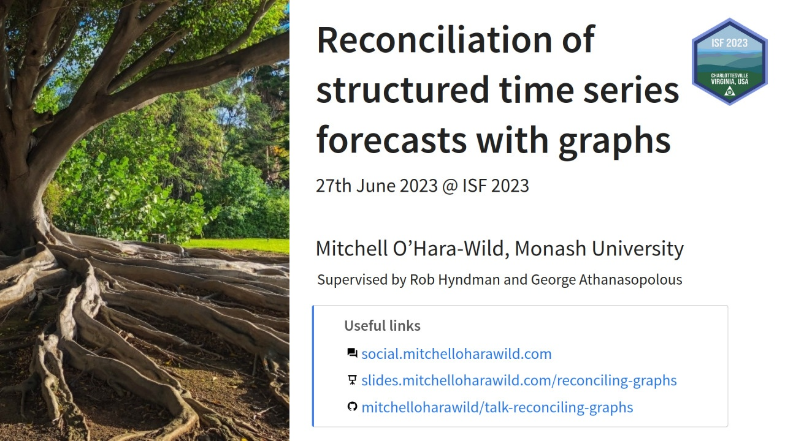

<!-- README.md is generated from README.Rmd. Please edit that file -->

```{r, include = FALSE}
knitr::opts_chunk$set(
  collapse = TRUE,
  comment = "#>"
)
```

# IIF Prato Reconciliation Workshop: Reconciliation of structured time series forecasts with graphs

<!-- badges: start -->
<!-- badges: end -->

Slides and notes for a talk at the 2023 IIF Workshop on Forecast Reconciliation (8th September 2023) in Prato, Italy.

<!-- A recording of this presentation is available on YouTube here: <https://www.youtube.com/watch?v=> -->

<!-- [](https://www.youtube.com/watch?v=) -->


#### Structure

* The basics of reconciliation (quickly)
* Hierarchical coherence
* Grouped coherence
* Graph coherence
* Disjoint graphs (cross-validation, incomplete reconciliation)
* Pruning the graph / tree
* Unbalanced trees
* Code in fable (multiple roots and disjoint children)
* Data exploration with graphs
* Forecast reconciliation on graphs

### Format

15-20 minute talk with some questions.
