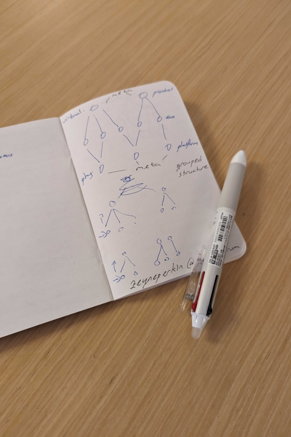
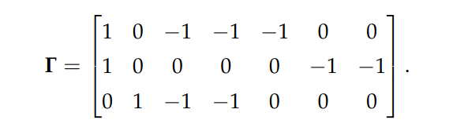
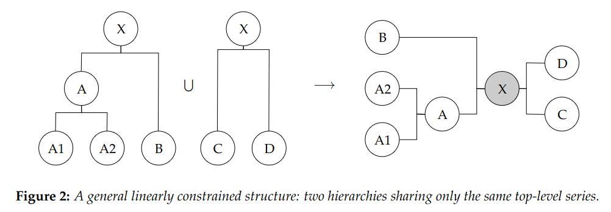
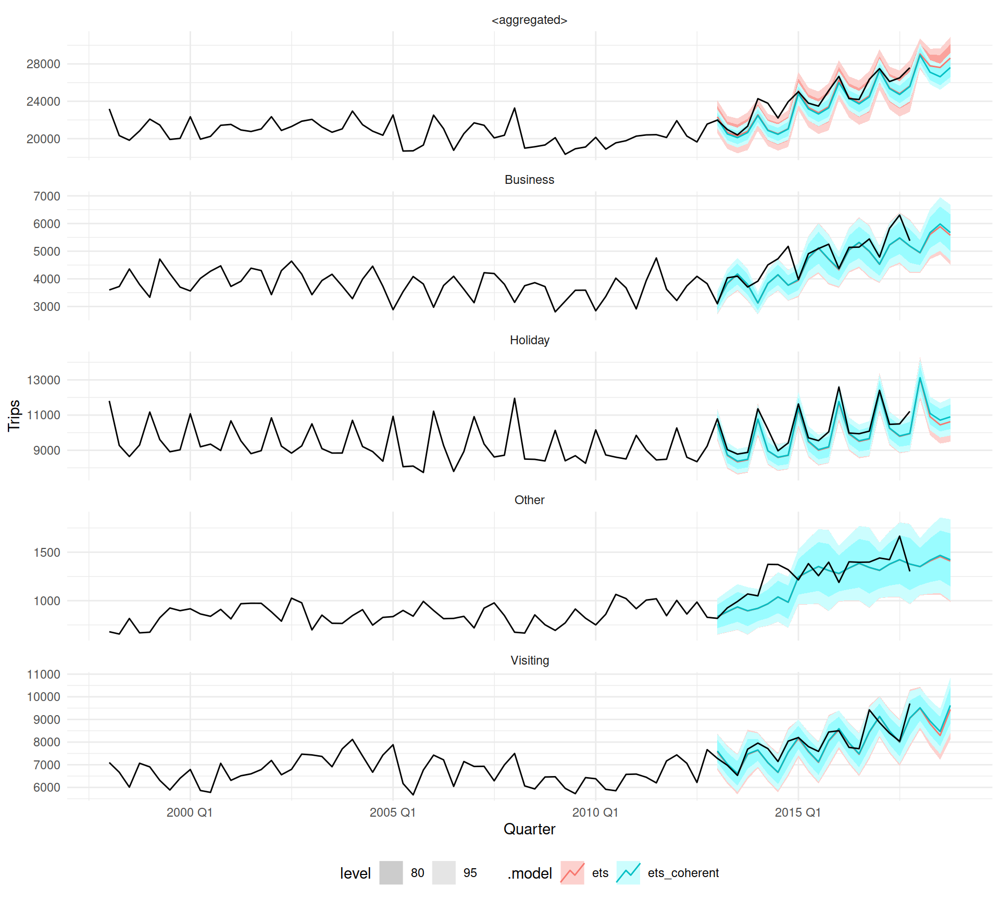
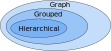

## {}

::: columns
::: {.column width="37.5%"}
:::
::: {.column width="60%"}

::: {.title data-id="title"}
Reconciliation of structured time series forecasts with graphs
:::

::: {.dateplace}
27th June 2023 @ IIF Reconciliation Workshop
:::

Mitchell O'Hara-Wild, Monash University

::: {.smaller}
Supervised by Rob Hyndman and George Athanasopolous
:::

::: {.callout-link}

## Useful links

{.icon} [social.mitchelloharawild.com](https://social.mitchelloharawild.com/)

{.icon} [slides.mitchelloharawild.com/prato2023](https://slides.mitchelloharawild.com/prato2023)

{.icon} [mitchelloharawild/talk-prato2023](https://github.com/mitchelloharawild/talk-prato2023)

:::

:::
:::

{.image-left}

## {}

::: columns
::: {.column width="40%"}
:::
::: {.column width="60%"}
### Hierarchical coherence

::: {.callout-note}
## Each aggregate has a single constraint

The basic constraint shown before is '[**hierarchical**]{.term}'


::: {.cell hash='index_cache/revealjs/unnamed-chunk-2_e2468f12c1170710157d289d4efa68d5'}
::: {.cell-output-display}

```{=html}
<div id="htmlwidget-908738ab7597be4b08f5" style="width:600px;height:300px;" class="visNetwork html-widget "></div>
<script type="application/json" data-for="htmlwidget-908738ab7597be4b08f5">{"x":{"nodes":{"label":["Attendees","Academic","Industry"],"id":[1,2,3],"level":[0,1,1]},"edges":{"from":[1,1],"to":[2,3]},"nodesToDataframe":true,"edgesToDataframe":true,"options":{"width":"100%","height":"100%","nodes":{"shape":"dot","font":{"size":16}},"manipulation":{"enabled":false},"layout":{"hierarchical":{"enabled":true,"direction":"UD","shakeTowards":"leaves"}},"edges":{"arrows":"to","scaling":{"label":{"enabled":false}}}},"groups":null,"width":600,"height":300,"idselection":{"enabled":false,"style":"width: 150px; height: 26px","useLabels":true,"main":"Select by id"},"byselection":{"enabled":false,"style":"width: 150px; height: 26px","multiple":false,"hideColor":"rgba(200,200,200,0.5)","highlight":false},"main":null,"submain":null,"footer":null,"background":"rgba(0, 0, 0, 0)","highlight":{"enabled":true,"hoverNearest":false,"degree":{"from":50000,"to":0},"algorithm":"hierarchical","hideColor":"rgba(200,200,200,0.5)","labelOnly":true},"collapse":{"enabled":true,"fit":false,"resetHighlight":true,"clusterOptions":{"fixed":true,"physics":true},"keepCoord":true,"labelSuffix":"(cluster)"},"tree":{"updateShape":true,"shapeVar":"dot","shapeY":"square"}},"evals":[],"jsHooks":[]}</script>
```

:::
:::

:::

:::
:::

{.image-left}


## {}

::: columns
::: {.column width="40%"}
:::
::: {.column width="60%"}
### Hierarchical coherence

::: {.callout-note}
## Each aggregate has a single constraint

[**Hierarchical**]{.term} series often have multiple layers


::: {.cell hash='index_cache/revealjs/unnamed-chunk-3_05fcfc17d23f30755869158cca7ddd7f'}
::: {.cell-output-display}

```{=html}
<div id="htmlwidget-d0505c9c04d02f41609b" style="width:600px;height:400px;" class="visNetwork html-widget "></div>
<script type="application/json" data-for="htmlwidget-d0505c9c04d02f41609b">{"x":{"nodes":{"label":["Attendees","Academic","Industry","Students","Staff"],"id":[1,2,3,4,5],"level":[0,1,1,2,2]},"edges":{"from":[1,1,2,2],"to":[2,3,4,5]},"nodesToDataframe":true,"edgesToDataframe":true,"options":{"width":"100%","height":"100%","nodes":{"shape":"dot","font":{"size":16}},"manipulation":{"enabled":false},"layout":{"hierarchical":{"enabled":true,"direction":"UD","shakeTowards":"leaves"}},"edges":{"arrows":"to","scaling":{"label":{"enabled":false}}}},"groups":null,"width":600,"height":400,"idselection":{"enabled":false,"style":"width: 150px; height: 26px","useLabels":true,"main":"Select by id"},"byselection":{"enabled":false,"style":"width: 150px; height: 26px","multiple":false,"hideColor":"rgba(200,200,200,0.5)","highlight":false},"main":null,"submain":null,"footer":null,"background":"rgba(0, 0, 0, 0)","highlight":{"enabled":true,"hoverNearest":false,"degree":{"from":50000,"to":0},"algorithm":"hierarchical","hideColor":"rgba(200,200,200,0.5)","labelOnly":true},"collapse":{"enabled":true,"fit":false,"resetHighlight":true,"clusterOptions":{"fixed":true,"physics":true},"keepCoord":true,"labelSuffix":"(cluster)"},"tree":{"updateShape":true,"shapeVar":"dot","shapeY":"square"}},"evals":[],"jsHooks":[]}</script>
```

:::
:::


::: {.fragment .fade-in}
In graph terms, this is known as a [**polytree**]{.term}.
:::
:::

:::
:::

{.image-left}


## {}

::: columns
::: {.column width="60%"}
### Grouped coherence

::: {.callout-note}
## Considering origin and workplace

Attendance can be disaggregated by both **origin** and **workplace**...

::: columns
::: {.column width="50%"}

::: {.cell hash='index_cache/revealjs/unnamed-chunk-4_7cb70f6f9b1a52b82651ef76722e5247'}
::: {.cell-output-display}

```{=html}
<div id="htmlwidget-99ee303147c921adae70" style="width:300px;height:300px;" class="visNetwork html-widget "></div>
<script type="application/json" data-for="htmlwidget-99ee303147c921adae70">{"x":{"nodes":{"label":["Attendees","Domestic","International"],"id":[1,2,3],"level":[0,1,1]},"edges":{"from":[1,1],"to":[2,3]},"nodesToDataframe":true,"edgesToDataframe":true,"options":{"width":"100%","height":"100%","nodes":{"shape":"dot","font":{"size":16}},"manipulation":{"enabled":false},"layout":{"hierarchical":{"enabled":true,"direction":"UD","shakeTowards":"leaves"}},"edges":{"arrows":"to","scaling":{"label":{"enabled":false}}}},"groups":null,"width":300,"height":300,"idselection":{"enabled":false,"style":"width: 150px; height: 26px","useLabels":true,"main":"Select by id"},"byselection":{"enabled":false,"style":"width: 150px; height: 26px","multiple":false,"hideColor":"rgba(200,200,200,0.5)","highlight":false},"main":null,"submain":null,"footer":null,"background":"rgba(0, 0, 0, 0)","highlight":{"enabled":true,"hoverNearest":false,"degree":{"from":50000,"to":0},"algorithm":"hierarchical","hideColor":"rgba(200,200,200,0.5)","labelOnly":true},"collapse":{"enabled":true,"fit":false,"resetHighlight":true,"clusterOptions":{"fixed":true,"physics":true},"keepCoord":true,"labelSuffix":"(cluster)"},"tree":{"updateShape":true,"shapeVar":"dot","shapeY":"square"}},"evals":[],"jsHooks":[]}</script>
```

:::
:::

:::
::: {.column width="50%"}

::: {.cell hash='index_cache/revealjs/unnamed-chunk-5_35f4ea409325e42e697046347cba0b7e'}
::: {.cell-output-display}

```{=html}
<div id="htmlwidget-719e0a0e30d8578f086a" style="width:300px;height:300px;" class="visNetwork html-widget "></div>
<script type="application/json" data-for="htmlwidget-719e0a0e30d8578f086a">{"x":{"nodes":{"label":["Attendees","Academia","Industry"],"id":[1,2,3],"level":[0,1,1]},"edges":{"from":[1,1],"to":[2,3]},"nodesToDataframe":true,"edgesToDataframe":true,"options":{"width":"100%","height":"100%","nodes":{"shape":"dot","font":{"size":16}},"manipulation":{"enabled":false},"layout":{"hierarchical":{"enabled":true,"direction":"UD","shakeTowards":"leaves"}},"edges":{"arrows":"to","scaling":{"label":{"enabled":false}}}},"groups":null,"width":300,"height":300,"idselection":{"enabled":false,"style":"width: 150px; height: 26px","useLabels":true,"main":"Select by id"},"byselection":{"enabled":false,"style":"width: 150px; height: 26px","multiple":false,"hideColor":"rgba(200,200,200,0.5)","highlight":false},"main":null,"submain":null,"footer":null,"background":"rgba(0, 0, 0, 0)","highlight":{"enabled":true,"hoverNearest":false,"degree":{"from":50000,"to":0},"algorithm":"hierarchical","hideColor":"rgba(200,200,200,0.5)","labelOnly":true},"collapse":{"enabled":true,"fit":false,"resetHighlight":true,"clusterOptions":{"fixed":true,"physics":true},"keepCoord":true,"labelSuffix":"(cluster)"},"tree":{"updateShape":true,"shapeVar":"dot","shapeY":"square"}},"evals":[],"jsHooks":[]}</script>
```

:::
:::

:::
:::
:::
:::
:::

{.image-right}


## {}

::: columns
::: {.column width="60%"}
### Grouped coherence

::: {.callout-note}
## Considering origin and workplace

and then further disaggregated by the other.

::: columns
::: {.column width="50%"}

::: {.cell hash='index_cache/revealjs/unnamed-chunk-6_1c05089581a74e5287f5d3182c4aca3d'}
::: {.cell-output-display}

```{=html}
<div id="htmlwidget-b074db299fe862e8937f" style="width:300px;height:400px;" class="visNetwork html-widget "></div>
<script type="application/json" data-for="htmlwidget-b074db299fe862e8937f">{"x":{"nodes":{"label":["Attendees","Domestic","International","Domestic\n& Academia","Domestic\n& Industry","International\n& Academia","International\n& Industry"],"id":[1,2,3,4,5,6,7],"level":[0,1,1,2,2,2,2]},"edges":{"from":[1,1,2,2,3,3],"to":[2,3,4,5,6,7]},"nodesToDataframe":true,"edgesToDataframe":true,"options":{"width":"100%","height":"100%","nodes":{"shape":"dot","font":{"size":16}},"manipulation":{"enabled":false},"layout":{"hierarchical":{"enabled":true,"direction":"UD","shakeTowards":"leaves"}},"edges":{"arrows":"to","scaling":{"label":{"enabled":false}}}},"groups":null,"width":300,"height":400,"idselection":{"enabled":false,"style":"width: 150px; height: 26px","useLabels":true,"main":"Select by id"},"byselection":{"enabled":false,"style":"width: 150px; height: 26px","multiple":false,"hideColor":"rgba(200,200,200,0.5)","highlight":false},"main":null,"submain":null,"footer":null,"background":"rgba(0, 0, 0, 0)","highlight":{"enabled":true,"hoverNearest":false,"degree":{"from":50000,"to":0},"algorithm":"hierarchical","hideColor":"rgba(200,200,200,0.5)","labelOnly":true},"collapse":{"enabled":true,"fit":false,"resetHighlight":true,"clusterOptions":{"fixed":true,"physics":true},"keepCoord":true,"labelSuffix":"(cluster)"},"tree":{"updateShape":true,"shapeVar":"dot","shapeY":"square"}},"evals":[],"jsHooks":[]}</script>
```

:::
:::

:::
::: {.column width="50%"}

::: {.cell hash='index_cache/revealjs/unnamed-chunk-7_7dd80c4cac99f215fc35f19f88fd7b48'}
::: {.cell-output-display}

```{=html}
<div id="htmlwidget-63cc95bb53543453cd3c" style="width:300px;height:400px;" class="visNetwork html-widget "></div>
<script type="application/json" data-for="htmlwidget-63cc95bb53543453cd3c">{"x":{"nodes":{"label":["Attendees","Academia","Industry","Academia\n& Domestic","Academia\n& International","Industry\n& Domestic","Industry\n& International"],"id":[1,2,3,4,5,6,7],"level":[0,1,1,2,2,2,2]},"edges":{"from":[1,1,2,2,3,3],"to":[2,3,4,5,6,7]},"nodesToDataframe":true,"edgesToDataframe":true,"options":{"width":"100%","height":"100%","nodes":{"shape":"dot","font":{"size":16}},"manipulation":{"enabled":false},"layout":{"hierarchical":{"enabled":true,"direction":"UD","shakeTowards":"leaves"}},"edges":{"arrows":"to","scaling":{"label":{"enabled":false}}}},"groups":null,"width":300,"height":400,"idselection":{"enabled":false,"style":"width: 150px; height: 26px","useLabels":true,"main":"Select by id"},"byselection":{"enabled":false,"style":"width: 150px; height: 26px","multiple":false,"hideColor":"rgba(200,200,200,0.5)","highlight":false},"main":null,"submain":null,"footer":null,"background":"rgba(0, 0, 0, 0)","highlight":{"enabled":true,"hoverNearest":false,"degree":{"from":50000,"to":0},"algorithm":"hierarchical","hideColor":"rgba(200,200,200,0.5)","labelOnly":true},"collapse":{"enabled":true,"fit":false,"resetHighlight":true,"clusterOptions":{"fixed":true,"physics":true},"keepCoord":true,"labelSuffix":"(cluster)"},"tree":{"updateShape":true,"shapeVar":"dot","shapeY":"square"}},"evals":[],"jsHooks":[]}</script>
```

:::
:::

:::
:::

A [**grouped**]{.term} structure has the **same top and bottom series**.

:::
:::
:::

{.image-right}

## {}

::: columns
::: {.column width="60%"}
### Grouped coherence

::: {.callout-note}
## Considering origin and workplace

The [**grouped**]{.term} structure can be plotted in a single graph.


::: {.cell hash='index_cache/revealjs/unnamed-chunk-8_42e11946f3a90ec20348b710e94e19ef'}
::: {.cell-output-display}

```{=html}
<div id="htmlwidget-d41d6052f6fdf186a1aa" style="width:600px;height:400px;" class="visNetwork html-widget "></div>
<script type="application/json" data-for="htmlwidget-d41d6052f6fdf186a1aa">{"x":{"nodes":{"label":["Attendees","Domestic","International","Academia","Industry","Domestic\n& Academia","Domestic\n& Industry","International\n& Academia","International\n& Industry"],"id":[1,2,3,4,5,6,7,8,9],"x":[-0.003371926391818159,-0.8582194521345512,0.86356954610132,0.172705587374925,-0.1708640521216115,-0.6628108638547205,-1,1,0.6736804153398088],"y":[-0.01390576951516009,0.1644008084973776,-0.1675798740901829,0.8533471780243223,-0.8822395672944368,1,-0.6855433690152226,0.6766420294961848,-1]},"edges":{"from":[1,1,1,1,2,4,2,5,3,4,3,5],"to":[2,3,4,5,6,6,7,7,8,8,9,9],"color":["#C87A8A","#C87A8A","#6B9D59","#6B9D59","#C87A8A","#6B9D59","#C87A8A","#6B9D59","#C87A8A","#6B9D59","#C87A8A","#6B9D59"]},"nodesToDataframe":true,"edgesToDataframe":true,"options":{"width":"100%","height":"100%","nodes":{"shape":"dot","physics":false,"size":20},"manipulation":{"enabled":false},"edges":{"smooth":false,"width":3,"arrows":"to","scaling":{"label":{"enabled":false}}},"physics":{"stabilization":false}},"groups":null,"width":600,"height":400,"idselection":{"enabled":false,"style":"width: 150px; height: 26px","useLabels":true,"main":"Select by id"},"byselection":{"enabled":false,"style":"width: 150px; height: 26px","multiple":false,"hideColor":"rgba(200,200,200,0.5)","highlight":false},"main":null,"submain":null,"footer":null,"background":"rgba(0, 0, 0, 0)","igraphlayout":{"type":"square"},"highlight":{"enabled":true,"hoverNearest":false,"degree":{"from":50000,"to":0},"algorithm":"all","hideColor":"rgba(200,200,200,0.5)","labelOnly":true},"collapse":{"enabled":false,"fit":false,"resetHighlight":true,"clusterOptions":null,"keepCoord":true,"labelSuffix":"(cluster)"},"tree":{"updateShape":true,"shapeVar":"dot","shapeY":"square"}},"evals":[],"jsHooks":[]}</script>
```

:::
:::


::: {.fragment .fade-in}
In graph terms, this is a [**directed acyclical graph**]{.term} (DAG).
:::
:::

:::
:::

{.image-right}


## {}

::: columns
::: {.column width="40%"}
:::
::: {.column width="60%"}
### Temporal coherence

::: {.callout-note}
A time series can be disaggregated by temporal granularity


::: {.cell hash='index_cache/revealjs/unnamed-chunk-9_49a33a651060fed51898706c3fabdd22'}
::: {.cell-output-display}

```{=html}
<div id="htmlwidget-43345730ed41751c47ac" style="width:600px;height:200px;" class="visNetwork html-widget "></div>
<script type="application/json" data-for="htmlwidget-43345730ed41751c47ac">{"x":{"nodes":{"label":["Year","Q1","Q2","Q3","Q4","Jan","Feb","Mar","Apr","May","Jun","Jul","Aug","Sep","Oct","Nov","Dec"],"id":[1,2,3,4,5,6,7,8,9,10,11,12,13,14,15,16,17],"level":[0,1,1,1,1,2,2,2,2,2,2,2,2,2,2,2,2]},"edges":{"from":[1,1,1,1,2,2,2,3,3,3,4,4,4,5,5,5],"to":[2,3,4,5,6,7,8,9,10,11,12,13,14,15,16,17]},"nodesToDataframe":true,"edgesToDataframe":true,"options":{"width":"100%","height":"100%","nodes":{"shape":"dot","font":{"size":40}},"manipulation":{"enabled":false},"layout":{"hierarchical":{"enabled":true,"direction":"UD","shakeTowards":"leaves"}},"edges":{"arrows":"to","scaling":{"label":{"enabled":false}}}},"groups":null,"width":600,"height":200,"idselection":{"enabled":false,"style":"width: 150px; height: 26px","useLabels":true,"main":"Select by id"},"byselection":{"enabled":false,"style":"width: 150px; height: 26px","multiple":false,"hideColor":"rgba(200,200,200,0.5)","highlight":false},"main":null,"submain":null,"footer":null,"background":"rgba(0, 0, 0, 0)","highlight":{"enabled":true,"hoverNearest":false,"degree":{"from":50000,"to":0},"algorithm":"hierarchical","hideColor":"rgba(200,200,200,0.5)","labelOnly":true},"collapse":{"enabled":true,"fit":false,"resetHighlight":true,"clusterOptions":{"fixed":true,"physics":true},"keepCoord":true,"labelSuffix":"(cluster)"},"tree":{"updateShape":true,"shapeVar":"dot","shapeY":"square"}},"evals":[],"jsHooks":[]}</script>
```

:::
:::

:::

::: {.callout-paper}
Temporal reconciliation is described in @ATHANASOPOULOS201760.
:::

::: {.fragment .fade-in}
::: {.callout-question}
## What type of coherence structure is this?

::: {.fragment .fade-in}
This is a [**polytree**]{.term}, so this structure is [**hierarchical**]{.term}.
:::
:::
:::
:::
:::

{.image-left}


## {}

::: columns
::: {.column width="40%"}
:::
::: {.column width="60%"}
### Temporal coherence


::: {.cell hash='index_cache/revealjs/unnamed-chunk-10_9737742f32f86b089902d144c114ca48'}
::: {.cell-output-display}

```{=html}
<div id="htmlwidget-a19ee93d0658b4ed9769" style="width:700px;height:200px;" class="visNetwork html-widget "></div>
<script type="application/json" data-for="htmlwidget-a19ee93d0658b4ed9769">{"x":{"nodes":{"label":["Year","Q1","Q2","Q3","Q4","Jan","Feb","Mar","Apr","May","Jun","Jul","Aug","Sep","Oct","Nov","Dec"],"id":[1,2,3,4,5,6,7,8,9,10,11,12,13,14,15,16,17],"level":[0,1,1,1,1,2,2,2,2,2,2,2,2,2,2,2,2]},"edges":{"from":[1,1,1,1,2,2,2,3,3,3,4,4,4,5,5,5],"to":[2,3,4,5,6,7,8,9,10,11,12,13,14,15,16,17]},"nodesToDataframe":true,"edgesToDataframe":true,"options":{"width":"100%","height":"100%","nodes":{"shape":"dot","font":{"size":40}},"manipulation":{"enabled":false},"layout":{"hierarchical":{"enabled":true,"direction":"UD","shakeTowards":"leaves"}},"edges":{"arrows":"to","scaling":{"label":{"enabled":false}}}},"groups":null,"width":700,"height":200,"idselection":{"enabled":false,"style":"width: 150px; height: 26px","useLabels":true,"main":"Select by id"},"byselection":{"enabled":false,"style":"width: 150px; height: 26px","multiple":false,"hideColor":"rgba(200,200,200,0.5)","highlight":false},"main":null,"submain":null,"footer":null,"background":"rgba(0, 0, 0, 0)","highlight":{"enabled":true,"hoverNearest":false,"degree":{"from":50000,"to":0},"algorithm":"hierarchical","hideColor":"rgba(200,200,200,0.5)","labelOnly":true},"collapse":{"enabled":true,"fit":false,"resetHighlight":true,"clusterOptions":{"fixed":true,"physics":true},"keepCoord":true,"labelSuffix":"(cluster)"},"tree":{"updateShape":true,"shapeVar":"dot","shapeY":"square"}},"evals":[],"jsHooks":[]}</script>
```

:::
:::

::: {.cell hash='index_cache/revealjs/unnamed-chunk-11_9d9cf04e7a54275b110d26f132e864b4'}
::: {.cell-output-display}

```{=html}
<div id="htmlwidget-88b5435f65bf9906378b" style="width:700px;height:200px;" class="visNetwork html-widget "></div>
<script type="application/json" data-for="htmlwidget-88b5435f65bf9906378b">{"x":{"nodes":{"label":["Year","Jan-Apr","May-Aug","Sep-Dec","Jan","Feb","Mar","Apr","May","Jun","Jul","Aug","Sep","Oct","Nov","Dec"],"id":[1,2,3,4,5,6,7,8,9,10,11,12,13,14,15,16],"level":[0,1,1,1,2,2,2,2,2,2,2,2,2,2,2,2]},"edges":{"from":[1,1,1,2,2,2,2,3,3,3,3,4,4,4,4],"to":[2,3,4,5,6,7,8,9,10,11,12,13,14,15,16]},"nodesToDataframe":true,"edgesToDataframe":true,"options":{"width":"100%","height":"100%","nodes":{"shape":"dot","font":{"size":40}},"manipulation":{"enabled":false},"layout":{"hierarchical":{"enabled":true,"direction":"UD","shakeTowards":"leaves"}},"edges":{"arrows":"to","scaling":{"label":{"enabled":false}}}},"groups":null,"width":700,"height":200,"idselection":{"enabled":false,"style":"width: 150px; height: 26px","useLabels":true,"main":"Select by id"},"byselection":{"enabled":false,"style":"width: 150px; height: 26px","multiple":false,"hideColor":"rgba(200,200,200,0.5)","highlight":false},"main":null,"submain":null,"footer":null,"background":"rgba(0, 0, 0, 0)","highlight":{"enabled":true,"hoverNearest":false,"degree":{"from":50000,"to":0},"algorithm":"hierarchical","hideColor":"rgba(200,200,200,0.5)","labelOnly":true},"collapse":{"enabled":true,"fit":false,"resetHighlight":true,"clusterOptions":{"fixed":true,"physics":true},"keepCoord":true,"labelSuffix":"(cluster)"},"tree":{"updateShape":true,"shapeVar":"dot","shapeY":"square"}},"evals":[],"jsHooks":[]}</script>
```

:::
:::


::: {.fragment .fade-in}
::: {.callout-question}
## What type of coherence structure is this?
::: {.fragment .fade-in}
This structure has the same top and bottom series, so 

temporal coherence is a [**grouped**]{.term} constraint.
:::
:::
:::
:::
:::

{.image-left}

## {}

::: columns
::: {.column width="40%"}
:::
::: {.column width="60%"}
### Temporal coherence

::: {.callout-tip}

Temporal coherence constraints are [**grouped**]{.term} can also be represented with [**directed acyclical graphs**]{.term} (DAGs).


::: {.cell hash='index_cache/revealjs/unnamed-chunk-12_303f110793675bc8b1b71069f2d33f2a'}
::: {.cell-output-display}

```{=html}
<div id="htmlwidget-c55b3292f3811e071a4f" style="width:700px;height:500px;" class="visNetwork html-widget "></div>
<script type="application/json" data-for="htmlwidget-c55b3292f3811e071a4f">{"x":{"nodes":{"label":["Year","Q1","Q2","Q3","Q4","Jan-Apr","May-Aug","Sep-Dec","Jan","Feb","Mar","Apr","May","Jun","Jul","Aug","Sep","Oct","Nov","Dec"],"id":[1,2,3,4,5,6,7,8,9,10,11,12,13,14,15,16,17,18,19,20],"x":[-0.05400594153204008,-0.4025836122675311,0.5279899127542234,0.3499252905890411,-0.6550819584534231,-0.1840021427311581,0.6690920750504299,-0.4897559363236491,-0.5080661329043736,-0.2400351501051694,-0.6834033281094694,0.3225316288369899,0.9185469261158925,1,0.7265907610337898,0.8740049766555253,-0.03854619266894377,-1,-0.9357883705518357,-0.7009937986365129],"y":[-0.08026365469781349,0.5549817302860942,0.2565900683007281,-0.602076668830982,-0.5290851774580543,0.6295752330530142,-0.2153387036532498,-0.6767056635977524,0.9669927230446371,1,0.7563276781751973,0.6913868441606599,0.2322349843697402,0.03229075048331187,-0.7226803954898391,-0.5592963964373876,-0.9135472332778896,-0.5978961503510797,-0.8600785125976133,-1]},"edges":{"from":[1,1,1,1,1,1,1,2,2,2,3,3,3,4,4,4,5,5,5,6,6,6,6,7,7,7,7,8,8,8,8],"to":[2,3,4,5,6,7,8,9,10,11,12,13,14,15,16,17,18,19,20,9,10,11,12,13,14,15,16,17,18,19,20],"grp":[1,1,1,1,2,2,2,1,1,1,1,1,1,1,1,1,1,1,1,2,2,2,2,2,2,2,2,2,2,2,2],"color":["#C87A8A","#C87A8A","#C87A8A","#C87A8A","#6B9D59","#6B9D59","#6B9D59","#C87A8A","#C87A8A","#C87A8A","#C87A8A","#C87A8A","#C87A8A","#C87A8A","#C87A8A","#C87A8A","#C87A8A","#C87A8A","#C87A8A","#6B9D59","#6B9D59","#6B9D59","#6B9D59","#6B9D59","#6B9D59","#6B9D59","#6B9D59","#6B9D59","#6B9D59","#6B9D59","#6B9D59"]},"nodesToDataframe":true,"edgesToDataframe":true,"options":{"width":"100%","height":"100%","nodes":{"shape":"dot","physics":false,"size":20,"font":{"size":30}},"manipulation":{"enabled":false},"edges":{"smooth":false,"width":3,"arrows":"to","scaling":{"label":{"enabled":false}}},"physics":{"stabilization":false}},"groups":null,"width":700,"height":500,"idselection":{"enabled":false,"style":"width: 150px; height: 26px","useLabels":true,"main":"Select by id"},"byselection":{"enabled":false,"style":"width: 150px; height: 26px","multiple":false,"hideColor":"rgba(200,200,200,0.5)","highlight":false},"main":null,"submain":null,"footer":null,"background":"rgba(0, 0, 0, 0)","igraphlayout":{"type":"square"},"highlight":{"enabled":true,"hoverNearest":false,"degree":{"from":50000,"to":0},"algorithm":"all","hideColor":"rgba(200,200,200,0.5)","labelOnly":true},"collapse":{"enabled":false,"fit":false,"resetHighlight":true,"clusterOptions":null,"keepCoord":true,"labelSuffix":"(cluster)"},"tree":{"updateShape":true,"shapeVar":"dot","shapeY":"square"}},"evals":[],"jsHooks":[]}</script>
```

:::
:::

:::

:::
:::

{.image-left}

## {.fragment-remove}

::: columns
::: {.column width="40%"}
:::
::: {.column width="60%"}
### Cross-temporal coherence

::: {.callout-note}

Since both [**grouped**]{.term} and [**temporal**]{.term} coherence are DAGs, the interaction between them is a single DAG.

::: {.fragment .fade-out fragment-index=1}
::: columns
::: {.column width="50%"}

::: {.cell hash='index_cache/revealjs/unnamed-chunk-13_f20b2a6fd431c8c94f0f8628229c9360'}
::: {.cell-output-display}

```{=html}
<div id="htmlwidget-cd30f43917514dab3a09" style="width:300px;height:300px;" class="visNetwork html-widget "></div>
<script type="application/json" data-for="htmlwidget-cd30f43917514dab3a09">{"x":{"nodes":{"label":["Year","Q1","Q2","Q3","Q4","Jan-Apr","May-Aug","Sep-Dec","Jan","Feb","Mar","Apr","May","Jun","Jul","Aug","Sep","Oct","Nov","Dec"],"id":[1,2,3,4,5,6,7,8,9,10,11,12,13,14,15,16,17,18,19,20],"x":[-0.05400594153204008,-0.4025836122675311,0.5279899127542234,0.3499252905890411,-0.6550819584534231,-0.1840021427311581,0.6690920750504299,-0.4897559363236491,-0.5080661329043736,-0.2400351501051694,-0.6834033281094694,0.3225316288369899,0.9185469261158925,1,0.7265907610337898,0.8740049766555253,-0.03854619266894377,-1,-0.9357883705518357,-0.7009937986365129],"y":[-0.08026365469781349,0.5549817302860942,0.2565900683007281,-0.602076668830982,-0.5290851774580543,0.6295752330530142,-0.2153387036532498,-0.6767056635977524,0.9669927230446371,1,0.7563276781751973,0.6913868441606599,0.2322349843697402,0.03229075048331187,-0.7226803954898391,-0.5592963964373876,-0.9135472332778896,-0.5978961503510797,-0.8600785125976133,-1]},"edges":{"from":[1,1,1,1,1,1,1,2,2,2,3,3,3,4,4,4,5,5,5,6,6,6,6,7,7,7,7,8,8,8,8],"to":[2,3,4,5,6,7,8,9,10,11,12,13,14,15,16,17,18,19,20,9,10,11,12,13,14,15,16,17,18,19,20],"grp":[1,1,1,1,2,2,2,1,1,1,1,1,1,1,1,1,1,1,1,2,2,2,2,2,2,2,2,2,2,2,2],"color":["#C87A8A","#C87A8A","#C87A8A","#C87A8A","#6B9D59","#6B9D59","#6B9D59","#C87A8A","#C87A8A","#C87A8A","#C87A8A","#C87A8A","#C87A8A","#C87A8A","#C87A8A","#C87A8A","#C87A8A","#C87A8A","#C87A8A","#6B9D59","#6B9D59","#6B9D59","#6B9D59","#6B9D59","#6B9D59","#6B9D59","#6B9D59","#6B9D59","#6B9D59","#6B9D59","#6B9D59"]},"nodesToDataframe":true,"edgesToDataframe":true,"options":{"width":"100%","height":"100%","nodes":{"shape":"dot","physics":false,"size":20,"font":{"size":30}},"manipulation":{"enabled":false},"edges":{"smooth":false,"width":3,"arrows":"to","scaling":{"label":{"enabled":false}}},"physics":{"stabilization":false}},"groups":null,"width":300,"height":300,"idselection":{"enabled":false,"style":"width: 150px; height: 26px","useLabels":true,"main":"Select by id"},"byselection":{"enabled":false,"style":"width: 150px; height: 26px","multiple":false,"hideColor":"rgba(200,200,200,0.5)","highlight":false},"main":null,"submain":null,"footer":null,"background":"rgba(0, 0, 0, 0)","igraphlayout":{"type":"square"},"highlight":{"enabled":true,"hoverNearest":false,"degree":{"from":50000,"to":0},"algorithm":"all","hideColor":"rgba(200,200,200,0.5)","labelOnly":true},"collapse":{"enabled":false,"fit":false,"resetHighlight":true,"clusterOptions":null,"keepCoord":true,"labelSuffix":"(cluster)"},"tree":{"updateShape":true,"shapeVar":"dot","shapeY":"square"}},"evals":[],"jsHooks":[]}</script>
```

:::
:::

:::
::: {.column width="50%"}

::: {.cell hash='index_cache/revealjs/unnamed-chunk-14_d7a0008b798733cedf12f11887acba0c'}
::: {.cell-output-display}

```{=html}
<div id="htmlwidget-ffdd87b8ec5af4c3bf9c" style="width:300px;height:300px;" class="visNetwork html-widget "></div>
<script type="application/json" data-for="htmlwidget-ffdd87b8ec5af4c3bf9c">{"x":{"nodes":{"label":["Attendees","Domestic","International","Academia","Industry","Domestic\n& Academia","Domestic\n& Industry","International\n& Academia","International\n& Industry"],"id":[1,2,3,4,5,6,7,8,9],"x":[-0.003371926391818159,-0.8582194521345512,0.86356954610132,0.172705587374925,-0.1708640521216115,-0.6628108638547205,-1,1,0.6736804153398088],"y":[-0.01390576951516009,0.1644008084973776,-0.1675798740901829,0.8533471780243223,-0.8822395672944368,1,-0.6855433690152226,0.6766420294961848,-1]},"edges":{"from":[1,1,1,1,2,4,2,5,3,4,3,5],"to":[2,3,4,5,6,6,7,7,8,8,9,9],"color":["#00A396","#00A396","#9189C7","#9189C7","#00A396","#9189C7","#00A396","#9189C7","#00A396","#9189C7","#00A396","#9189C7"]},"nodesToDataframe":true,"edgesToDataframe":true,"options":{"width":"100%","height":"100%","nodes":{"shape":"dot","physics":false,"size":20},"manipulation":{"enabled":false},"edges":{"smooth":false,"width":3,"arrows":"to","scaling":{"label":{"enabled":false}}},"physics":{"stabilization":false}},"groups":null,"width":300,"height":300,"idselection":{"enabled":false,"style":"width: 150px; height: 26px","useLabels":true,"main":"Select by id"},"byselection":{"enabled":false,"style":"width: 150px; height: 26px","multiple":false,"hideColor":"rgba(200,200,200,0.5)","highlight":false},"main":null,"submain":null,"footer":null,"background":"rgba(0, 0, 0, 0)","igraphlayout":{"type":"square"},"highlight":{"enabled":true,"hoverNearest":false,"degree":{"from":50000,"to":0},"algorithm":"all","hideColor":"rgba(200,200,200,0.5)","labelOnly":true},"collapse":{"enabled":false,"fit":false,"resetHighlight":true,"clusterOptions":null,"keepCoord":true,"labelSuffix":"(cluster)"},"tree":{"updateShape":true,"shapeVar":"dot","shapeY":"square"}},"evals":[],"jsHooks":[]}</script>
```

:::
:::

:::
:::
:::

::: {.fragment .fade-up fragment-index=1}

::: {.cell hash='index_cache/revealjs/unnamed-chunk-15_8b1f6fb7a6a348e6e3b0f4e8b3dc057c'}
::: {.cell-output-display}

```{=html}
<div id="htmlwidget-2ab87043777a719f4532" style="width:600px;height:400px;" class="visNetwork html-widget "></div>
<script type="application/json" data-for="htmlwidget-2ab87043777a719f4532">{"x":{"nodes":{"label":["Attendees","Domestic","International","Academia","Industry","Domestic\n& Academia","Domestic\n& Industry","International\n& Academia","International\n& Industry"],"image":["resources/temporal-graph-node.png","resources/temporal-graph-node.png","resources/temporal-graph-node.png","resources/temporal-graph-node.png","resources/temporal-graph-node.png","resources/temporal-graph-node.png","resources/temporal-graph-node.png","resources/temporal-graph-node.png","resources/temporal-graph-node.png"],"shape":["image","image","image","image","image","image","image","image","image"],"id":[1,2,3,4,5,6,7,8,9],"x":[-0.003371926391818159,-0.8582194521345512,0.86356954610132,0.172705587374925,-0.1708640521216115,-0.6628108638547205,-1,1,0.6736804153398088],"y":[-0.01390576951516009,0.1644008084973776,-0.1675798740901829,0.8533471780243223,-0.8822395672944368,1,-0.6855433690152226,0.6766420294961848,-1]},"edges":{"from":[1,1,1,1,2,4,2,5,3,4,3,5],"to":[2,3,4,5,6,6,7,7,8,8,9,9],"color":["#00A396","#00A396","#9189C7","#9189C7","#00A396","#9189C7","#00A396","#9189C7","#00A396","#9189C7","#00A396","#9189C7"]},"nodesToDataframe":true,"edgesToDataframe":true,"options":{"width":"100%","height":"100%","nodes":{"shape":"dot","physics":false,"size":20},"manipulation":{"enabled":false},"edges":{"smooth":false,"width":3,"arrows":"to","scaling":{"label":{"enabled":false}}},"physics":{"stabilization":false}},"groups":null,"width":600,"height":400,"idselection":{"enabled":false,"style":"width: 150px; height: 26px","useLabels":true,"main":"Select by id"},"byselection":{"enabled":false,"style":"width: 150px; height: 26px","multiple":false,"hideColor":"rgba(200,200,200,0.5)","highlight":false},"main":null,"submain":null,"footer":null,"background":"rgba(0, 0, 0, 0)","igraphlayout":{"type":"square"},"highlight":{"enabled":true,"hoverNearest":false,"degree":{"from":50000,"to":0},"algorithm":"all","hideColor":"rgba(200,200,200,0.5)","labelOnly":true},"collapse":{"enabled":false,"fit":false,"resetHighlight":true,"clusterOptions":null,"keepCoord":true,"labelSuffix":"(cluster)"},"tree":{"updateShape":true,"shapeVar":"dot","shapeY":"square"}},"evals":[],"jsHooks":[]}</script>
```

:::
:::

:::

:::

:::
:::

{.image-left}

## {}

::: columns
::: {.column width="60%"}
### Graph coherence

A [**directed acyclical graph**]{.term} does **not** require a common top and bottom series.

<br>

::: {.fragment .fade-in}

What happens if we relax this definition of grouped coherence, and use the more general DAG structure.

::: {.callout-question}
## Is it reasonable to leverage the full generality of DAGs?

::: {.fragment .fade-in}
Yes! Let's see why.
:::
:::
:::

:::
:::

{.image-right}


## {auto-animate=true}

::: columns
::: {.column width="40%"}
:::
::: {.column width="60%"}
### Unbalanced graphs

What if the coherency structure had **different bottom series**?

<br>

This often occurs in these circumstances:

1. Cross-temporal with series observed at **different granularities**.
2. Multiple **different approaches** to calculating the top series.
3. Partial coherency by **'trimming' sparse disaggregations**.

:::
:::

{.image-left}


## {auto-animate=true}

::: columns
::: {.column width="40%"}
:::
::: {.column width="60%"}

1. Cross-temporal with series observed at **different granularities**.

::: {.fragment .fade-in}

::: {.callout-tip}
## Example
Suppose `Sales` is reported quarterly, but `Profit` and `Costs` twice yearly.

:::{data-id="graphtemp"}

::: {.cell hash='index_cache/revealjs/unnamed-chunk-16_42f3d35d5360d11dfe5ebdf564b746ff'}
::: {.cell-output-display}

```{=html}
<div id="htmlwidget-2b524d7ec00b7062e1dd" style="width:600px;height:400px;" class="visNetwork html-widget "></div>
<script type="application/json" data-for="htmlwidget-2b524d7ec00b7062e1dd">{"x":{"nodes":{"label":["Profit (Y)","Sales (Y)","-Costs (Y)","Profit (S1)","Sales (S1)","-Costs (S1)","Profit (S2)","Sales (S2)","-Costs (S2)","Sales (Q1)","Sales (Q2)","Sales (Q3)","Sales (Q4)"],"id":[1,2,3,4,5,6,7,8,9,10,11,12,13],"x":[-0.3582040390209666,-0.01049498420926265,-0.700218109949812,0.01263882916904779,0.4996034937053015,-0.3669663160980248,-0.6891066332450266,-0.420604205726013,-1,1,0.9110964283020246,-0.2857898768441832,-0.7420082841920523],"y":[0.3522192958286621,-0.007039236584347019,0.6987669242810171,0.6859429479520101,0.4041352682392674,1,-0.02160509927886167,-0.513009636272736,0.361759628924097,0.2780657174748593,0.7191427299340987,-1,-0.9216143712625707]},"edges":{"from":[1,1,4,4,7,7,1,1,2,2,3,3,5,5,8,8],"to":[2,3,5,6,8,9,4,7,5,8,6,9,10,11,12,13],"grp":[1,1,1,1,1,1,2,2,2,2,2,2,3,3,3,3],"color":["#C87A8A","#C87A8A","#C87A8A","#C87A8A","#C87A8A","#C87A8A","#6B9D59","#6B9D59","#6B9D59","#6B9D59","#6B9D59","#6B9D59","#5F96C2","#5F96C2","#5F96C2","#5F96C2"]},"nodesToDataframe":true,"edgesToDataframe":true,"options":{"width":"100%","height":"100%","nodes":{"shape":"dot","physics":false,"size":20,"font":{"size":25}},"manipulation":{"enabled":false},"edges":{"smooth":false,"width":3,"arrows":"to","scaling":{"label":{"enabled":false}}},"physics":{"stabilization":false}},"groups":null,"width":600,"height":400,"idselection":{"enabled":false,"style":"width: 150px; height: 26px","useLabels":true,"main":"Select by id"},"byselection":{"enabled":false,"style":"width: 150px; height: 26px","multiple":false,"hideColor":"rgba(200,200,200,0.5)","highlight":false},"main":null,"submain":null,"footer":null,"background":"rgba(0, 0, 0, 0)","igraphlayout":{"type":"square"},"highlight":{"enabled":true,"hoverNearest":false,"degree":{"from":50000,"to":0},"algorithm":"all","hideColor":"rgba(200,200,200,0.5)","labelOnly":true},"collapse":{"enabled":false,"fit":false,"resetHighlight":true,"clusterOptions":null,"keepCoord":true,"labelSuffix":"(cluster)"},"tree":{"updateShape":true,"shapeVar":"dot","shapeY":"square"}},"evals":[],"jsHooks":[]}</script>
```

:::
:::

:::
:::
:::
:::
:::

{.image-left}

## {auto-animate=true}

::: columns
::: {.column width="40%"}
:::
::: {.column width="60%"}

1. Cross-temporal with series observed at **different granularities**.

::: {.callout-tip}
## Example

:::{data-id="graphtemp"}

::: {.cell hash='index_cache/revealjs/unnamed-chunk-17_32eff466982ee4d797c8adb68f878021'}
::: {.cell-output-display}

```{=html}
<div id="htmlwidget-f42cd75c4906780efe0a" style="width:600px;height:400px;" class="visNetwork html-widget "></div>
<script type="application/json" data-for="htmlwidget-f42cd75c4906780efe0a">{"x":{"nodes":{"label":["Profit (Y)","Sales (Y)","-Costs (Y)","Profit (S1)","Sales (S1)","-Costs (S1)","Profit (S2)","Sales (S2)","-Costs (S2)","Sales (Q1)","Sales (Q2)","Sales (Q3)","Sales (Q4)"],"id":[1,2,3,4,5,6,7,8,9,10,11,12,13],"x":[-0.3582040390209666,-0.01049498420926265,-0.700218109949812,0.01263882916904779,0.4996034937053015,-0.3669663160980248,-0.6891066332450266,-0.420604205726013,-1,1,0.9110964283020246,-0.2857898768441832,-0.7420082841920523],"y":[0.3522192958286621,-0.007039236584347019,0.6987669242810171,0.6859429479520101,0.4041352682392674,1,-0.02160509927886167,-0.513009636272736,0.361759628924097,0.2780657174748593,0.7191427299340987,-1,-0.9216143712625707]},"edges":{"from":[1,1,4,4,7,7,1,1,2,2,3,3,5,5,8,8],"to":[2,3,5,6,8,9,4,7,5,8,6,9,10,11,12,13],"grp":[1,1,1,1,1,1,2,2,2,2,2,2,3,3,3,3],"color":["#C87A8A","#C87A8A","#C87A8A","#C87A8A","#C87A8A","#C87A8A","#6B9D59","#6B9D59","#6B9D59","#6B9D59","#6B9D59","#6B9D59","#5F96C2","#5F96C2","#5F96C2","#5F96C2"]},"nodesToDataframe":true,"edgesToDataframe":true,"options":{"width":"100%","height":"100%","nodes":{"shape":"dot","physics":false,"size":20,"font":{"size":25}},"manipulation":{"enabled":false},"edges":{"smooth":false,"width":3,"arrows":"to","scaling":{"label":{"enabled":false}}},"physics":{"stabilization":false}},"groups":null,"width":600,"height":400,"idselection":{"enabled":false,"style":"width: 150px; height: 26px","useLabels":true,"main":"Select by id"},"byselection":{"enabled":false,"style":"width: 150px; height: 26px","multiple":false,"hideColor":"rgba(200,200,200,0.5)","highlight":false},"main":null,"submain":null,"footer":null,"background":"rgba(0, 0, 0, 0)","igraphlayout":{"type":"square"},"highlight":{"enabled":true,"hoverNearest":false,"degree":{"from":50000,"to":0},"algorithm":"all","hideColor":"rgba(200,200,200,0.5)","labelOnly":true},"collapse":{"enabled":false,"fit":false,"resetHighlight":true,"clusterOptions":null,"keepCoord":true,"labelSuffix":"(cluster)"},"tree":{"updateShape":true,"shapeVar":"dot","shapeY":"square"}},"evals":[],"jsHooks":[]}</script>
```

:::
:::

:::
This allows the higher frequency `Sales` data to be used with the less frequent `Profit` and `Costs` data!
:::
:::
:::

{.image-left}

## {auto-animate=true}

::: columns
::: {.column width="40%"}
:::
::: {.column width="60%"}

2. Multiple **different approaches** to calculating the top series.

::: {.fragment .fade-in}
::: {.callout-tip}
## Example

Australian GDP is calculated with 3 approaches:

* Income approach (I)
* Expenditure approach (E)
* Production approach (P)

For simplicity consider a small part of these graphs. The complete graph structure has many more disaggregates.

:::

::: {.callout-paper}
This example is used in @Athanasopoulos2020.
:::
:::

:::
:::

{.image-left}


## {auto-animate=true}

::: columns
::: {.column width="40%"}
:::
::: {.column width="60%"}

2. Multiple **different approaches** to calculating the top series.

::: {.callout-tip}

* Income approach (I)


::: {.cell hash='index_cache/revealjs/unnamed-chunk-18_ad6f7cd6a7967166d82caa111ae09b7b'}
::: {.cell-output-display}

```{=html}
<div id="htmlwidget-74c8ba1e7731f9504d26" style="width:600px;height:200px;" class="visNetwork html-widget "></div>
<script type="application/json" data-for="htmlwidget-74c8ba1e7731f9504d26">{"x":{"nodes":{"label":["GDP","Statistical\nDiscrepancy (I)","Income","Taxes"],"id":[1,2,3,4],"level":[0,1,1,1]},"edges":{"from":[1,1,1],"to":[2,3,4]},"nodesToDataframe":true,"edgesToDataframe":true,"options":{"width":"100%","height":"100%","nodes":{"shape":"dot","font":{"size":16}},"manipulation":{"enabled":false},"layout":{"hierarchical":{"enabled":true,"direction":"UD","shakeTowards":"leaves"}},"edges":{"arrows":"to","scaling":{"label":{"enabled":false}}}},"groups":null,"width":600,"height":200,"idselection":{"enabled":false,"style":"width: 150px; height: 26px","useLabels":true,"main":"Select by id"},"byselection":{"enabled":false,"style":"width: 150px; height: 26px","multiple":false,"hideColor":"rgba(200,200,200,0.5)","highlight":false},"main":null,"submain":null,"footer":null,"background":"rgba(0, 0, 0, 0)","highlight":{"enabled":true,"hoverNearest":false,"degree":{"from":50000,"to":0},"algorithm":"hierarchical","hideColor":"rgba(200,200,200,0.5)","labelOnly":true},"collapse":{"enabled":true,"fit":false,"resetHighlight":true,"clusterOptions":{"fixed":true,"physics":true},"keepCoord":true,"labelSuffix":"(cluster)"},"tree":{"updateShape":true,"shapeVar":"dot","shapeY":"square"}},"evals":[],"jsHooks":[]}</script>
```

:::
:::


* Expenditure approach (E)


::: {.cell hash='index_cache/revealjs/unnamed-chunk-19_ff6abc5ad18cd81ea1b2e834eb94020b'}
::: {.cell-output-display}

```{=html}
<div id="htmlwidget-83f933b82471402b4d00" style="width:600px;height:200px;" class="visNetwork html-widget "></div>
<script type="application/json" data-for="htmlwidget-83f933b82471402b4d00">{"x":{"nodes":{"label":["GDP","Statistical\nDiscrepancy (E)","-Imports","Exports","Expenses"],"id":[1,2,3,4,5],"level":[0,1,1,1,1]},"edges":{"from":[1,1,1,1],"to":[2,3,4,5]},"nodesToDataframe":true,"edgesToDataframe":true,"options":{"width":"100%","height":"100%","nodes":{"shape":"dot","font":{"size":16}},"manipulation":{"enabled":false},"layout":{"hierarchical":{"enabled":true,"direction":"UD","shakeTowards":"leaves"}},"edges":{"arrows":"to","scaling":{"label":{"enabled":false}}}},"groups":null,"width":600,"height":200,"idselection":{"enabled":false,"style":"width: 150px; height: 26px","useLabels":true,"main":"Select by id"},"byselection":{"enabled":false,"style":"width: 150px; height: 26px","multiple":false,"hideColor":"rgba(200,200,200,0.5)","highlight":false},"main":null,"submain":null,"footer":null,"background":"rgba(0, 0, 0, 0)","highlight":{"enabled":true,"hoverNearest":false,"degree":{"from":50000,"to":0},"algorithm":"hierarchical","hideColor":"rgba(200,200,200,0.5)","labelOnly":true},"collapse":{"enabled":true,"fit":false,"resetHighlight":true,"clusterOptions":{"fixed":true,"physics":true},"keepCoord":true,"labelSuffix":"(cluster)"},"tree":{"updateShape":true,"shapeVar":"dot","shapeY":"square"}},"evals":[],"jsHooks":[]}</script>
```

:::
:::


:::
:::
:::

{.image-left}

## {auto-animate=true}

::: columns
::: {.column width="40%"}
:::
::: {.column width="60%"}

2. Multiple **different approaches** to calculating the top series.

::: {.callout-tip}

* Combined approach (I & E)


::: {.cell hash='index_cache/revealjs/unnamed-chunk-20_a020c8798f70f800d98b9cb6a6264286'}
::: {.cell-output-display}

```{=html}
<div id="htmlwidget-a58fb31876f84597848e" style="width:600px;height:400px;" class="visNetwork html-widget "></div>
<script type="application/json" data-for="htmlwidget-a58fb31876f84597848e">{"x":{"nodes":{"label":["GDP","Statistical\nDiscrepancy (I)","Income","Taxes","Statistical\nDiscrepancy (E)","-Imports","Exports","Expenses"],"id":[1,2,3,4,5,6,7,8],"x":[0.0181208309193075,0.8676001522280246,-0.7349134380824285,0.3967080063204802,0.09631010583399746,-1,-0.4959156544771076,1],"y":[-0.03547901733548309,0.5473023377285768,0.6735302376679089,-1,1,-0.1882988257743036,-0.9329726046020161,-0.3413304861903519]},"edges":{"from":[1,1,1,1,1,1,1],"to":[2,3,4,5,6,7,8],"color":["#C87A8A","#C87A8A","#C87A8A","#6B9D59","#6B9D59","#6B9D59","#6B9D59"]},"nodesToDataframe":true,"edgesToDataframe":true,"options":{"width":"100%","height":"100%","nodes":{"shape":"dot","physics":false,"size":20},"manipulation":{"enabled":false},"edges":{"smooth":false,"width":3,"arrows":"to","scaling":{"label":{"enabled":false}}},"physics":{"stabilization":false}},"groups":null,"width":600,"height":400,"idselection":{"enabled":false,"style":"width: 150px; height: 26px","useLabels":true,"main":"Select by id"},"byselection":{"enabled":false,"style":"width: 150px; height: 26px","multiple":false,"hideColor":"rgba(200,200,200,0.5)","highlight":false},"main":null,"submain":null,"footer":null,"background":"rgba(0, 0, 0, 0)","igraphlayout":{"type":"square"},"highlight":{"enabled":true,"hoverNearest":false,"degree":{"from":50000,"to":0},"algorithm":"all","hideColor":"rgba(200,200,200,0.5)","labelOnly":true},"collapse":{"enabled":false,"fit":false,"resetHighlight":true,"clusterOptions":null,"keepCoord":true,"labelSuffix":"(cluster)"},"tree":{"updateShape":true,"shapeVar":"dot","shapeY":"square"}},"evals":[],"jsHooks":[]}</script>
```

:::
:::


:::
:::
:::

{.image-left}


## {.fragment-remove auto-animate=true}

::: columns
::: {.column width="40%"}
:::
::: {.column width="60%"}

3. Partial coherency by **'trimming' sparse disaggregations**.

::: {.callout-tip}

If the bottom level is too sparse, it is **more complicated** to model and reconciliation can **worsen forecast accuracy**.

<!-- Graph coherency allows us to ignore our problems (reconciling count data models) by trimming the leaf nodes of the graph. -->

:::{.fragment .fade-out fragment-index=1}

::: {.cell hash='index_cache/revealjs/unnamed-chunk-21_0d35fa5493f21133ac541ad00c1172b6'}
::: {.cell-output-display}

```{=html}
<div id="htmlwidget-19f1b135c6b1ef39d773" style="width:600px;height:400px;" class="visNetwork html-widget "></div>
<script type="application/json" data-for="htmlwidget-19f1b135c6b1ef39d773">{"x":{"nodes":{"label":["Attendees","Domestic","International","Academia","Industry","Domestic\n& Academia","Domestic\n& Industry","International\n& Academia","International\n& Industry"],"id":[1,2,3,4,5,6,7,8,9],"x":[-0.003371926391818159,-0.8582194521345512,0.86356954610132,0.172705587374925,-0.1708640521216115,-0.6628108638547205,-1,1,0.6736804153398088],"y":[-0.01390576951516009,0.1644008084973776,-0.1675798740901829,0.8533471780243223,-0.8822395672944368,1,-0.6855433690152226,0.6766420294961848,-1]},"edges":{"from":[1,1,1,1,2,4,2,5,3,4,3,5],"to":[2,3,4,5,6,6,7,7,8,8,9,9],"color":["#C87A8A","#C87A8A","#6B9D59","#6B9D59","#C87A8A","#6B9D59","#C87A8A","#6B9D59","#C87A8A","#6B9D59","#C87A8A","#6B9D59"]},"nodesToDataframe":true,"edgesToDataframe":true,"options":{"width":"100%","height":"100%","nodes":{"shape":"dot","physics":false,"size":20},"manipulation":{"enabled":false},"edges":{"smooth":false,"width":3,"arrows":"to","scaling":{"label":{"enabled":false}}},"physics":{"stabilization":false}},"groups":null,"width":600,"height":400,"idselection":{"enabled":false,"style":"width: 150px; height: 26px","useLabels":true,"main":"Select by id"},"byselection":{"enabled":false,"style":"width: 150px; height: 26px","multiple":false,"hideColor":"rgba(200,200,200,0.5)","highlight":false},"main":null,"submain":null,"footer":null,"background":"rgba(0, 0, 0, 0)","igraphlayout":{"type":"square"},"highlight":{"enabled":true,"hoverNearest":false,"degree":{"from":50000,"to":0},"algorithm":"all","hideColor":"rgba(200,200,200,0.5)","labelOnly":true},"collapse":{"enabled":false,"fit":false,"resetHighlight":true,"clusterOptions":null,"keepCoord":true,"labelSuffix":"(cluster)"},"tree":{"updateShape":true,"shapeVar":"dot","shapeY":"square"}},"evals":[],"jsHooks":[]}</script>
```

:::
:::

:::

:::{.fragment .fade-up fragment-index=1}

::: {.cell hash='index_cache/revealjs/unnamed-chunk-22_9f3b49ae81c65fcc261eaaec53769441'}
::: {.cell-output-display}

```{=html}
<div id="htmlwidget-798f4ad75c95f15f8b74" style="width:600px;height:400px;" class="visNetwork html-widget "></div>
<script type="application/json" data-for="htmlwidget-798f4ad75c95f15f8b74">{"x":{"nodes":{"label":["Attendees","Domestic","International","Academia","Industry"],"id":[1,2,3,4,5],"x":[-0.001759247510430439,0.4649221558329919,-1,1,-0.4701575758691139],"y":[-0.0004033440696582513,1,0.468617046048023,-0.4710768300799481,-1]},"edges":{"from":[1,1,1,1],"to":[2,3,4,5],"color":["#C87A8A","#C87A8A","#6B9D59","#6B9D59"]},"nodesToDataframe":true,"edgesToDataframe":true,"options":{"width":"100%","height":"100%","nodes":{"shape":"dot","physics":false,"size":20},"manipulation":{"enabled":false},"edges":{"smooth":false,"width":3,"arrows":"to","scaling":{"label":{"enabled":false}}},"physics":{"stabilization":false}},"groups":null,"width":600,"height":400,"idselection":{"enabled":false,"style":"width: 150px; height: 26px","useLabels":true,"main":"Select by id"},"byselection":{"enabled":false,"style":"width: 150px; height: 26px","multiple":false,"hideColor":"rgba(200,200,200,0.5)","highlight":false},"main":null,"submain":null,"footer":null,"background":"rgba(0, 0, 0, 0)","igraphlayout":{"type":"square"},"highlight":{"enabled":true,"hoverNearest":false,"degree":{"from":50000,"to":0},"algorithm":"all","hideColor":"rgba(200,200,200,0.5)","labelOnly":true},"collapse":{"enabled":false,"fit":false,"resetHighlight":true,"clusterOptions":null,"keepCoord":true,"labelSuffix":"(cluster)"},"tree":{"updateShape":true,"shapeVar":"dot","shapeY":"square"}},"evals":[],"jsHooks":[]}</script>
```

:::
:::

:::

:::
:::
:::

{.image-left}


## {auto-animate=true}

::: columns
::: {.column width="60%"}
### Incomplete graphs

What if the coherency structure doesn't completely aggregate, so that there are **multiple top series**.

<br>

::: {.fragment .fade-in}
This can occur for many reasons:

1. Cross-validation with reconciliation
2. Partial/local coherency <br>(e.g. not including worldwide total)
:::

:::
:::

{.image-right}


## {auto-animate=true}

::: columns
::: {.column width="60%"}

1. Cross-validation with reconciliation

::: {.callout-tip}
It makes no sense to aggregate folds of cross-validation.

::: {.fragment .fade-in}

A suitable DAG for cross-validated hierarchies is 


::: {.cell hash='index_cache/revealjs/unnamed-chunk-23_b0f9d0b6419b1f998f23a0e00c917617'}
::: {.cell-output-display}

```{=html}
<div id="htmlwidget-9707c2ad20a8a780990a" style="width:600px;height:400px;" class="visNetwork html-widget "></div>
<script type="application/json" data-for="htmlwidget-9707c2ad20a8a780990a">{"x":{"nodes":{"label":["Attendees\n(fold 1)","Academic\n(fold 1)","Industry\n(fold 1)","Attendees\n(fold 2)","Academic\n(fold 2)","Industry\n(fold 2)","Attendees\n(fold 3)","Academic\n(fold 3)","Industry\n(fold 3)"],"id":[1,2,3,4,5,6,7,8,9],"x":[-0.7771115886284494,-1,-0.5479317420191581,0.04555610562827783,0.5416865832808138,-0.4511010814451824,0.7336814933590186,0.4621687484879951,1],"y":[0.4508815641554542,-0.04886791008397484,0.9417089317630387,-0.9777716560130811,-0.9451423221379904,-1,0.5353849818406153,1,0.06400782226108581]},"edges":{"from":[1,1,4,4,7,7],"to":[2,3,5,6,8,9]},"nodesToDataframe":true,"edgesToDataframe":true,"options":{"width":"100%","height":"100%","nodes":{"shape":"dot","physics":false,"size":20},"manipulation":{"enabled":false},"edges":{"smooth":false,"width":3,"arrows":"to","scaling":{"label":{"enabled":false}}},"physics":{"stabilization":false}},"groups":null,"width":600,"height":400,"idselection":{"enabled":false,"style":"width: 150px; height: 26px","useLabels":true,"main":"Select by id"},"byselection":{"enabled":false,"style":"width: 150px; height: 26px","multiple":false,"hideColor":"rgba(200,200,200,0.5)","highlight":false},"main":null,"submain":null,"footer":null,"background":"rgba(0, 0, 0, 0)","igraphlayout":{"type":"square"},"highlight":{"enabled":true,"hoverNearest":false,"degree":{"from":50000,"to":0},"algorithm":"all","hideColor":"rgba(200,200,200,0.5)","labelOnly":true},"collapse":{"enabled":false,"fit":false,"resetHighlight":true,"clusterOptions":null,"keepCoord":true,"labelSuffix":"(cluster)"},"tree":{"updateShape":true,"shapeVar":"dot","shapeY":"square"}},"evals":[],"jsHooks":[]}</script>
```

:::
:::


:::

::: {.fragment .fade-in}
Each disjoint graph can be reconciled separately.
:::

:::

:::
:::

{.image-right}


## {auto-animate=true}

::: columns
::: {.column width="60%"}

2. Partial/local coherency

::: {.callout-tip}

## Motivated by discussion with Zeynepz yesterday


::: {.cell hash='index_cache/revealjs/unnamed-chunk-24_293fe21dc47d591d8f668eb8ca3e8d77'}
::: {.cell-output-display}

```{=html}
<div id="htmlwidget-d297b4b060ed03696609" style="width:600px;height:400px;" class="visNetwork html-widget "></div>
<script type="application/json" data-for="htmlwidget-d297b4b060ed03696609">{"x":{"nodes":{"label":["Facebook","Instagram","WhatsApp","Messenger","Oculus","","","","",""],"shape":["triangle","triangle","triangle","triangle","triangle","circle","circle","circle","circle","circle"],"id":[1,2,3,4,5,6,7,8,9,10],"x":[1,0.8090169943749475,0.3090169943749475,-0.3090169943749473,-0.8090169943749473,-1,-0.8090169943749476,-0.3090169943749476,0.3090169943749472,0.8090169943749475],"y":[0,0.6180339887498949,1,1,0.6180339887498951,2.220446049250313e-16,-0.6180339887498947,-0.9999999999999999,-1,-0.6180339887498951]},"edges":{"from":[1,1,1,2,2,3,3,4,4,5],"to":[6,7,8,9,10,6,7,8,9,10]},"nodesToDataframe":true,"edgesToDataframe":true,"options":{"width":"100%","height":"100%","nodes":{"shape":"dot","physics":false,"size":20},"manipulation":{"enabled":false},"edges":{"smooth":false,"width":3,"arrows":"to","scaling":{"label":{"enabled":false}}},"physics":{"stabilization":false}},"groups":null,"width":600,"height":400,"idselection":{"enabled":false,"style":"width: 150px; height: 26px","useLabels":true,"main":"Select by id"},"byselection":{"enabled":false,"style":"width: 150px; height: 26px","multiple":false,"hideColor":"rgba(200,200,200,0.5)","highlight":false},"main":null,"submain":null,"footer":null,"background":"rgba(0, 0, 0, 0)","igraphlayout":{"type":"square"},"highlight":{"enabled":true,"hoverNearest":false,"degree":{"from":50000,"to":0},"algorithm":"all","hideColor":"rgba(200,200,200,0.5)","labelOnly":true},"collapse":{"enabled":false,"fit":false,"resetHighlight":true,"clusterOptions":null,"keepCoord":true,"labelSuffix":"(cluster)"},"tree":{"updateShape":true,"shapeVar":"dot","shapeY":"square"}},"evals":[],"jsHooks":[]}</script>
```

:::
:::


:::

:::
:::

{.image-right}

## {auto-animate=true}

::: columns
::: {.column width="60%"}

2. Partial/local coherency

::: {.callout-tip}

## Adding Meta as the single parent results in a hierarchy


::: {.cell hash='index_cache/revealjs/unnamed-chunk-25_31f756a302ada18725e1b2aa265ca5b2'}
::: {.cell-output-display}

```{=html}
<div id="htmlwidget-7e7bbb494f761957a0e7" style="width:600px;height:400px;" class="visNetwork html-widget "></div>
<script type="application/json" data-for="htmlwidget-7e7bbb494f761957a0e7">{"x":{"nodes":{"label":["Facebook","Instagram","WhatsApp","Messenger","Oculus","","","","","","Meta"],"shape":["triangle","triangle","triangle","triangle","triangle","circle","circle","circle","circle","circle","star"],"id":[1,2,3,4,5,6,7,8,9,10,11],"x":[-0.571124951733712,0.6896991221030009,-0.5503295009007478,0.146553883693229,0.5537200131579443,-1,-0.9089508891878479,-0.3634786477218064,0.6637360306906206,1,0.06168987497947809],"y":[0.02938562779538478,-0.01784534055795728,-0.6978283133735672,0.8416319207142804,-1,-0.1864096742582104,-0.866363405872039,1,0.9408184169156235,-0.7967512930882792,-0.2484499166846748]},"edges":{"from":[1,1,1,2,2,3,3,4,4,5,11,11,11,11,11],"to":[6,7,8,9,10,6,7,8,9,10,1,2,3,4,5]},"nodesToDataframe":true,"edgesToDataframe":true,"options":{"width":"100%","height":"100%","nodes":{"shape":"dot","physics":false,"size":20},"manipulation":{"enabled":false},"edges":{"smooth":false,"width":3,"arrows":"to","scaling":{"label":{"enabled":false}}},"physics":{"stabilization":false}},"groups":null,"width":600,"height":400,"idselection":{"enabled":false,"style":"width: 150px; height: 26px","useLabels":true,"main":"Select by id"},"byselection":{"enabled":false,"style":"width: 150px; height: 26px","multiple":false,"hideColor":"rgba(200,200,200,0.5)","highlight":false},"main":null,"submain":null,"footer":null,"background":"rgba(0, 0, 0, 0)","igraphlayout":{"type":"square"},"highlight":{"enabled":true,"hoverNearest":false,"degree":{"from":50000,"to":0},"algorithm":"all","hideColor":"rgba(200,200,200,0.5)","labelOnly":true},"collapse":{"enabled":false,"fit":false,"resetHighlight":true,"clusterOptions":null,"keepCoord":true,"labelSuffix":"(cluster)"},"tree":{"updateShape":true,"shapeVar":"dot","shapeY":"square"}},"evals":[],"jsHooks":[]}</script>
```

:::
:::


*Note that this isn't a polytree, due to common/shared leafs.*

:::

:::
:::

{.image-right}

## {.fragment-remove}

::: columns

::: {.column width="40%"}
:::
::: {.column width="60%"}
### Related work

General linearly constrained time series [@girolimetto2023point]

::: {.callout-tip}

## Generalisation from zero-constrained representation

::: {.fragment .fade-out fragment-index=1}

:::

::: {.fragment .fade-up fragment-index=1}

:::

::: {.fragment .fade-up fragment-index=2}
For linear reconciliation, both graph coherence and 'general
linearly constrained' coherence are equivalent.
:::

:::

:::
:::

{.image-left}


## {.fragment-remove}

::: columns

::: {.column width="40%"}
:::
::: {.column width="60%"}
### Implementation in fable

All currently experimental, but functional. Code on GitHub in various branches.


::: {.fragment .fade-out fragment-index=3}
::: {.callout-tip}
## Useful functions

* Create aggregates from bottom series with `aggregate_key()` <br> (and someday `aggregate_index()` for temporal)
* [Or get artisanal with `agg_vec()` and `graph_vec()` for complex aggregation structures and graphs.]{.fragment fragment-index=1}
* [Add coherency constraints to models/forecasts with `reconcile()` and `min_trace()`]{.fragment fragment-index=2}

:::
:::

::: {.fragment .fade-up fragment-index=3}
::: {.callout-warning}
## Planned functionality

* Tools for identifying sub-graphs for exploring series
* [Tools for changing the graph without removing data]{.fragment fragment-index=4}
* [Tools for validating operations which change the graph]{.fragment fragment-index=5}

:::
:::

:::
:::

{.image-left}


## {auto-animate=TRUE}

::: columns

::: {.column width="40%"}
:::

::: {.column width="60%"}
### Examples with fable


::: {.cell hash='index_cache/revealjs/unnamed-chunk-26_0e5eccbb3d743738157aacf1430b21b6'}

:::

::: {.cell hash='index_cache/revealjs/unnamed-chunk-27_5b5e170826a1adeef126e59512819ae6'}

```{.r .cell-code}
library(tsibble)
library(fable)
tourism
```

::: {.cell-output .cell-output-stdout}
```
# A tsibble: 24,320 x 5 [1Q]
# Key:       Region, State, Purpose [304]
   Quarter Region   State           Purpose  Trips
     <qtr> <chr>    <chr>           <chr>    <dbl>
 1 1998 Q1 Adelaide South Australia Business  135.
 2 1998 Q2 Adelaide South Australia Business  110.
 3 1998 Q3 Adelaide South Australia Business  166.
 4 1998 Q4 Adelaide South Australia Business  127.
 5 1999 Q1 Adelaide South Australia Business  137.
 6 1999 Q2 Adelaide South Australia Business  200.
 7 1999 Q3 Adelaide South Australia Business  169.
 8 1999 Q4 Adelaide South Australia Business  134.
 9 2000 Q1 Adelaide South Australia Business  154.
10 2000 Q2 Adelaide South Australia Business  169.
# i 24,310 more rows
```
:::
:::


:::


:::

{.image-left}


## {auto-animate=TRUE}

::: columns

::: {.column width="40%"}
:::

::: {.column width="60%"}
### Examples with fable


::: {.cell hash='index_cache/revealjs/unnamed-chunk-28_20ead00fad04246691deb4db682bcdbc'}

```{.r .cell-code}
tourism |> 
  aggregate_key(
    Purpose * (State / Region),
    Trips = sum(Trips)
  )
```

::: {.cell-output .cell-output-stdout}
```
# A tsibble: 34,000 x 5 [1Q]
# Key:       Purpose, State, Region [425]
   Quarter Purpose      State        Region        Trips
     <qtr> <chr*>       <chr*>       <chr*>        <dbl>
 1 1998 Q1 <aggregated> <aggregated> <aggregated> 23182.
 2 1998 Q2 <aggregated> <aggregated> <aggregated> 20323.
 3 1998 Q3 <aggregated> <aggregated> <aggregated> 19827.
 4 1998 Q4 <aggregated> <aggregated> <aggregated> 20830.
 5 1999 Q1 <aggregated> <aggregated> <aggregated> 22087.
 6 1999 Q2 <aggregated> <aggregated> <aggregated> 21458.
 7 1999 Q3 <aggregated> <aggregated> <aggregated> 19914.
 8 1999 Q4 <aggregated> <aggregated> <aggregated> 20028.
 9 2000 Q1 <aggregated> <aggregated> <aggregated> 22339.
10 2000 Q2 <aggregated> <aggregated> <aggregated> 19941.
# i 33,990 more rows
```
:::
:::


:::


:::

{.image-left}

## {auto-animate=TRUE}

::: columns

::: {.column width="40%"}
:::

::: {.column width="60%"}
### Examples with fable


::: {.cell hash='index_cache/revealjs/unnamed-chunk-29_1eba1c3ede467fa4a9399d2e34bfa2f4'}

```{.r .cell-code}
tourism |> 
  aggregate_key(
    Purpose * (State / Region),
    Trips = sum(Trips)
  ) |> 
  key_data()
```

::: {.cell-output .cell-output-stdout}
```
# A tibble: 425 x 4
   Purpose  State           Region                 .rows
   <chr*>   <chr*>          <chr*>                 <lis>
 1 Business ACT             Canberra                [80]
 2 Business ACT             <aggregated>            [80]
 3 Business New South Wales Blue Mountains          [80]
 4 Business New South Wales Capital Country         [80]
 5 Business New South Wales Central Coast           [80]
 6 Business New South Wales Central NSW             [80]
 7 Business New South Wales Hunter                  [80]
 8 Business New South Wales New England North West  [80]
 9 Business New South Wales North Coast NSW         [80]
10 Business New South Wales Outback NSW             [80]
# i 415 more rows
```
:::
:::


:::


:::

{.image-left}


## {auto-animate=TRUE}

::: columns

::: {.column width="40%"}
:::

::: {.column width="60%"}
### Examples with fable


::: {.cell hash='index_cache/revealjs/unnamed-chunk-30_a22834bdc3148a45884def730f129a3a'}

```{.r .cell-code}
tourism |> 
  aggregate_key(
    Purpose * State,
    Trips = sum(Trips)
  ) |>  
  key_data()
```

::: {.cell-output .cell-output-stdout}
```
# A tibble: 45 x 3
   Purpose      State                    .rows
   <chr*>       <chr*>             <list<int>>
 1 Business     ACT                       [80]
 2 Business     New South Wales           [80]
 3 Business     Northern Territory        [80]
 4 Business     Queensland                [80]
 5 Business     South Australia           [80]
 6 Business     Tasmania                  [80]
 7 Business     Victoria                  [80]
 8 Business     Western Australia         [80]
 9 Business     <aggregated>              [80]
10 Holiday      ACT                       [80]
11 Holiday      New South Wales           [80]
12 Holiday      Northern Territory        [80]
13 Holiday      Queensland                [80]
14 Holiday      South Australia           [80]
15 Holiday      Tasmania                  [80]
16 Holiday      Victoria                  [80]
17 Holiday      Western Australia         [80]
18 Holiday      <aggregated>              [80]
19 Other        ACT                       [80]
20 Other        New South Wales           [80]
21 Other        Northern Territory        [80]
22 Other        Queensland                [80]
23 Other        South Australia           [80]
24 Other        Tasmania                  [80]
25 Other        Victoria                  [80]
26 Other        Western Australia         [80]
27 Other        <aggregated>              [80]
28 Visiting     ACT                       [80]
29 Visiting     New South Wales           [80]
30 Visiting     Northern Territory        [80]
31 Visiting     Queensland                [80]
32 Visiting     South Australia           [80]
33 Visiting     Tasmania                  [80]
34 Visiting     Victoria                  [80]
35 Visiting     Western Australia         [80]
36 Visiting     <aggregated>              [80]
37 <aggregated> ACT                       [80]
38 <aggregated> New South Wales           [80]
39 <aggregated> Northern Territory        [80]
40 <aggregated> Queensland                [80]
41 <aggregated> South Australia           [80]
42 <aggregated> Tasmania                  [80]
43 <aggregated> Victoria                  [80]
44 <aggregated> Western Australia         [80]
45 <aggregated> <aggregated>              [80]
```
:::
:::


:::


:::

{.image-left}

## {auto-animate=TRUE}

::: columns

::: {.column width="40%"}
:::

::: {.column width="60%"}
### Examples with fable


::: {.cell hash='index_cache/revealjs/unnamed-chunk-31_7321e48f3cc3a8c17cc6c6f6a50caf1c'}

```{.r .cell-code}
tourism |> 
  aggregate_key(
    Purpose : State,
    Trips = sum(Trips)
  ) |> 
  key_data()
```

::: {.cell-output .cell-output-stdout}
```
# A tibble: 33 x 3
   Purpose      State                    .rows
   <chr*>       <chr*>             <list<int>>
 1 Business     ACT                       [80]
 2 Business     New South Wales           [80]
 3 Business     Northern Territory        [80]
 4 Business     Queensland                [80]
 5 Business     South Australia           [80]
 6 Business     Tasmania                  [80]
 7 Business     Victoria                  [80]
 8 Business     Western Australia         [80]
 9 Holiday      ACT                       [80]
10 Holiday      New South Wales           [80]
11 Holiday      Northern Territory        [80]
12 Holiday      Queensland                [80]
13 Holiday      South Australia           [80]
14 Holiday      Tasmania                  [80]
15 Holiday      Victoria                  [80]
16 Holiday      Western Australia         [80]
17 Other        ACT                       [80]
18 Other        New South Wales           [80]
19 Other        Northern Territory        [80]
20 Other        Queensland                [80]
21 Other        South Australia           [80]
22 Other        Tasmania                  [80]
23 Other        Victoria                  [80]
24 Other        Western Australia         [80]
25 Visiting     ACT                       [80]
26 Visiting     New South Wales           [80]
27 Visiting     Northern Territory        [80]
28 Visiting     Queensland                [80]
29 Visiting     South Australia           [80]
30 Visiting     Tasmania                  [80]
31 Visiting     Victoria                  [80]
32 Visiting     Western Australia         [80]
33 <aggregated> <aggregated>              [80]
```
:::
:::


:::


:::

{.image-left}


## {auto-animate=TRUE}

::: columns

::: {.column width="40%"}
:::

::: {.column width="60%"}
### Examples with fable


::: {.cell hash='index_cache/revealjs/unnamed-chunk-32_880a9a9ee40ba4314c6cc3e0476ac176'}

```{.r .cell-code}
tourism |> 
  aggregate_key(
    Purpose + State,
    Trips = sum(Trips)
  ) |> 
  key_data()
```

::: {.cell-output .cell-output-stdout}
```
# A tibble: 13 x 3
   Purpose      State                    .rows
   <chr*>       <chr*>             <list<int>>
 1 Business     <aggregated>              [80]
 2 Holiday      <aggregated>              [80]
 3 Other        <aggregated>              [80]
 4 Visiting     <aggregated>              [80]
 5 <aggregated> ACT                       [80]
 6 <aggregated> New South Wales           [80]
 7 <aggregated> Northern Territory        [80]
 8 <aggregated> Queensland                [80]
 9 <aggregated> South Australia           [80]
10 <aggregated> Tasmania                  [80]
11 <aggregated> Victoria                  [80]
12 <aggregated> Western Australia         [80]
13 <aggregated> <aggregated>              [80]
```
:::
:::


:::


:::

{.image-left}

## {auto-animate=TRUE}

::: columns

::: {.column width="40%"}
:::

::: {.column width="60%"}
### Examples with fable


::: {.cell hash='index_cache/revealjs/unnamed-chunk-33_a0e35d8005bf1d8df4fd7437e9816784'}

```{.r .cell-code}
tourism |> 
  aggregate_key(
    0 + Purpose + State,
    Trips = sum(Trips)
  ) |> 
  key_data()
```

::: {.cell-output .cell-output-stdout}
```
# A tibble: 12 x 3
   Purpose      State                    .rows
   <chr*>       <chr*>             <list<int>>
 1 Business     <aggregated>              [80]
 2 Holiday      <aggregated>              [80]
 3 Other        <aggregated>              [80]
 4 Visiting     <aggregated>              [80]
 5 <aggregated> ACT                       [80]
 6 <aggregated> New South Wales           [80]
 7 <aggregated> Northern Territory        [80]
 8 <aggregated> Queensland                [80]
 9 <aggregated> South Australia           [80]
10 <aggregated> Tasmania                  [80]
11 <aggregated> Victoria                  [80]
12 <aggregated> Western Australia         [80]
```
:::
:::


:::


:::

{.image-left}

## {auto-animate=TRUE}

::: columns

::: {.column width="40%"}
:::

::: {.column width="60%"}
### Examples with fable


::: {.cell hash='index_cache/revealjs/unnamed-chunk-34_bac141ad92ed0a640fb560556140269f'}

```{.r .cell-code}
tourism |> 
  aggregate_key(
    Purpose,
    Trips = sum(Trips)
  ) |> 
  stretch_tsibble(.step = 4, .init = 60) |> 
  key_data()
```

::: {.cell-output .cell-output-stdout}
```
# A tibble: 30 x 3
     .id Purpose            .rows
   <int> <chr*>       <list<int>>
 1     1 Business            [60]
 2     1 Holiday             [60]
 3     1 Other               [60]
 4     1 Visiting            [60]
 5     1 <aggregated>        [60]
 6     2 Business            [64]
 7     2 Holiday             [64]
 8     2 Other               [64]
 9     2 Visiting            [64]
10     2 <aggregated>        [64]
11     3 Business            [68]
12     3 Holiday             [68]
13     3 Other               [68]
14     3 Visiting            [68]
15     3 <aggregated>        [68]
16     4 Business            [72]
17     4 Holiday             [72]
18     4 Other               [72]
19     4 Visiting            [72]
20     4 <aggregated>        [72]
21     5 Business            [76]
22     5 Holiday             [76]
23     5 Other               [76]
24     5 Visiting            [76]
25     5 <aggregated>        [76]
26     6 Business            [80]
27     6 Holiday             [80]
28     6 Other               [80]
29     6 Visiting            [80]
30     6 <aggregated>        [80]
```
:::
:::


:::


:::

{.image-left}

## {auto-animate=TRUE}

::: columns

::: {.column width="40%"}
:::

::: {.column width="60%"}
### Examples with fable


::: {.cell hash='index_cache/revealjs/unnamed-chunk-35_7be74170da19e3c1a466ef0548d965f8'}

```{.r .cell-code}
tourism |> 
  aggregate_key(
    Purpose,
    Trips = sum(Trips)
  ) |> 
  stretch_tsibble(.step = 4, .init = 60) |> 
  model(ets = ETS(Trips)) |> 
  reconcile(ets_coherent = min_trace(ets)) |> 
  forecast(h = "1 year")
```

::: {.cell-output .cell-output-stdout}
```
# A fable: 240 x 6 [1Q]
# Key:     .id, Purpose, .model [60]
     .id Purpose  .model       Quarter            Trips
   <int> <chr*>   <chr>          <qtr>           <dist>
 1     1 Business ets          2013 Q1   N(3135, 46032)
 2     1 Business ets          2013 Q2   N(3832, 73712)
 3     1 Business ets          2013 Q3   N(4158, 93320)
 4     1 Business ets          2013 Q4   N(3781, 88006)
 5     1 Business ets_coherent 2013 Q1   N(3159, 45373)
 6     1 Business ets_coherent 2013 Q2   N(3848, 69353)
 7     1 Business ets_coherent 2013 Q3   N(4177, 86871)
 8     1 Business ets_coherent 2013 Q4   N(3795, 83437)
 9     1 Holiday  ets          2013 Q1 N(10442, 211377)
10     1 Holiday  ets          2013 Q2  N(8698, 146661)
# i 230 more rows
# i 1 more variable: .mean <dbl>
```
:::
:::


:::


:::

{.image-left}


## {auto-animate=TRUE}

::: columns

::: {.column width="40%"}
:::

::: {.column width="60%"}
### Examples with fable


::: {.cell hash='index_cache/revealjs/unnamed-chunk-36_930380e9349c4e3dd3ceff9b92ea07cd'}
::: {.cell-output-display}
{width=960}
:::
:::


:::


:::

{.image-left}


## {}

::: columns
::: {.column width="60%"}
### Recap

::: {.callout-note}

## Coherence and graph theory

* [**Hierarchical**]{.term} coherence is a [**polytree**]{.term}.
* [**Grouped**]{.term} coherence is a *restricted* [**DAG**]{.term}.
* [**Graph**]{.term} coherence is an *unrestricted* [**DAG**]{.term}.

DAGs are a useful tool for representing structured time series and producing coherent forecasts.

:::

::: {.fragment .fade-in}

{fig-align="center"}

:::

:::
:::

{.image-right}

## {}

### What else?

::: columns
::: {.column width="60%"}

::: {.callout-tip}

## Other benefits

1. Access to efficient graph algorithms and ideas
2. Exploration and description of structured time series
3. Familiar computing grammar for coherent data

:::

::: {.callout-paper}

## Future work

1. Rework fable's reconciliation to be built around graphs
2. Investigate alternative graph reconciliation methods (non-linear constraints, faster at-scale reconciliation)

:::
:::
:::

{.image-right}


## Thanks for your time!

::: columns
::: {.column width="60%"}

::: {.callout-tip}
## Final remarks

* I'm trying to build a user-friendly design framework for forecast reconciliation - it's hard!
* Great to hear the many different reconciliation techniques, and the many ideas for new methods.
* Searching for strange coherency constraints, let's chat!
:::


::: {.callout-link}

## Useful links

{.icon} [social.mitchelloharawild.com](https://social.mitchelloharawild.com/)

{.icon} [slides.mitchelloharawild.com/prato2023](https://slides.mitchelloharawild.com/prato2023)

{.icon} [mitchelloharawild/talk-prato2023](https://github.com/mitchelloharawild/talk-prato2023)

:::

:::
:::

{.image-right}


<!-- ## {} -->

<!-- ::: columns -->
<!-- ::: {.column width="40%"} -->
<!-- ::: -->
<!-- ::: {.column width="60%"} -->
<!-- ### Visualising structured time series -->
<!-- ::: -->
<!-- ::: -->

<!-- {.image-left} -->


## Unsplash credits

::: {.callout-unsplash}

## Thanks to these Unsplash contributors for their photos


::: {.cell hash='index_cache/revealjs/unsplash_0291571fab3d266b79a79cb254a4841f'}
::: {.cell-output-display}

```{=html}
<ul>
<li>Aleksandar Radovanovic: <a href="https://unsplash.com/photos/mXKXJI98aTE">Tree rings pattern</a></li>
<li>Courtney Smith: <a href="https://unsplash.com/photos/pCLKkPHpCz0">Photo</a></li>
<li>Eilis Garvey: <a href="https://unsplash.com/photos/MskbR8VLNrA">Exposed tree roots</a></li>
<li>Emma Gossett: <a href="https://unsplash.com/photos/B645igbiKCw">Banyan tree in Hawai&lt;U+2019&gt;i </a></li>
<li>Firosnv. Photography: <a href="https://unsplash.com/photos/Rr3B0LH7W3k">Top View, Shot on iPhone 7
Location: Fort…</a></li>
<li>Meriç Dağlı: <a href="https://unsplash.com/photos/7NBO76G5JsE">Photo</a></li>
<li>五玄土 ORIENTO: <a href="https://unsplash.com/photos/-OBffuUekfQ">Photo</a></li>
<li>Sander Weeteling: <a href="https://unsplash.com/photos/KABfjuSOx74">Photo</a></li>
<li>Yoksel 🌿 Zok: <a href="https://unsplash.com/photos/aEMEMsBNqeo">Photo</a></li>
<li>Zach Callahan: <a href="https://unsplash.com/photos/-i51Ke0ROTo">Photo</a></li>
</ul>

```

:::
:::


:::

## References
